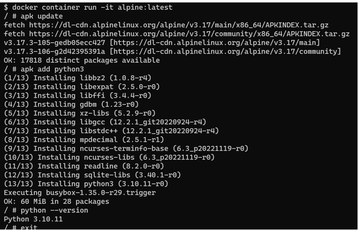
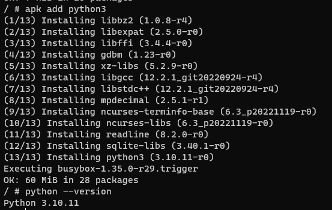
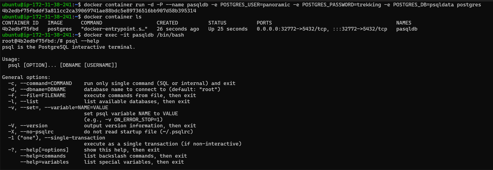
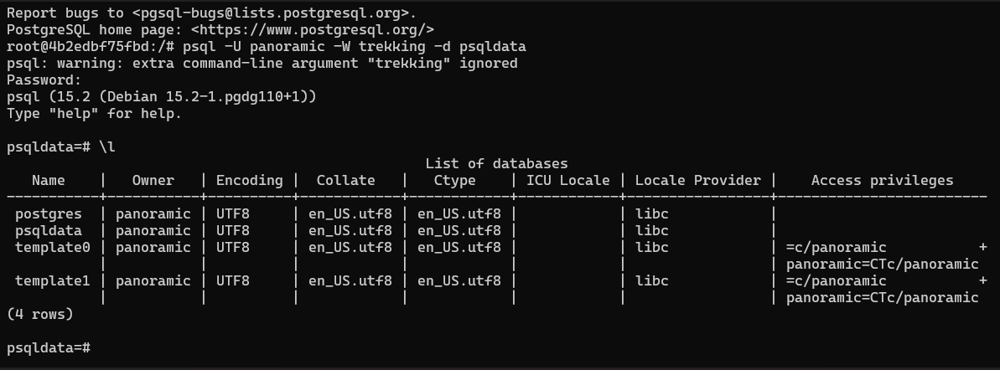
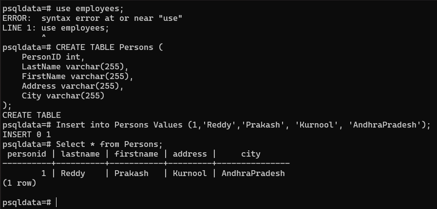
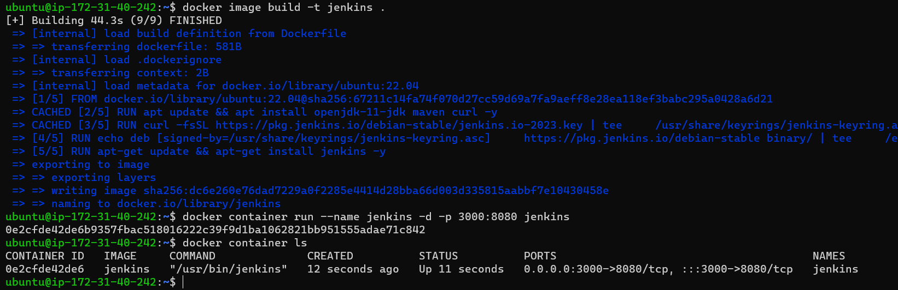
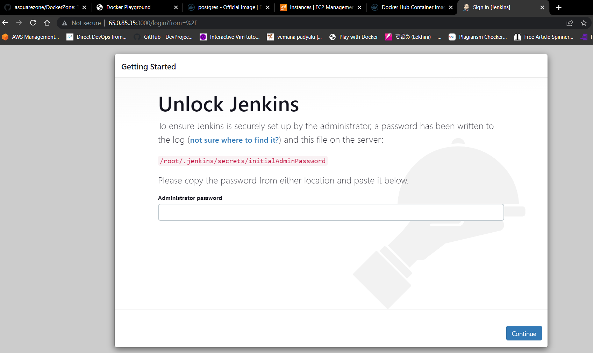
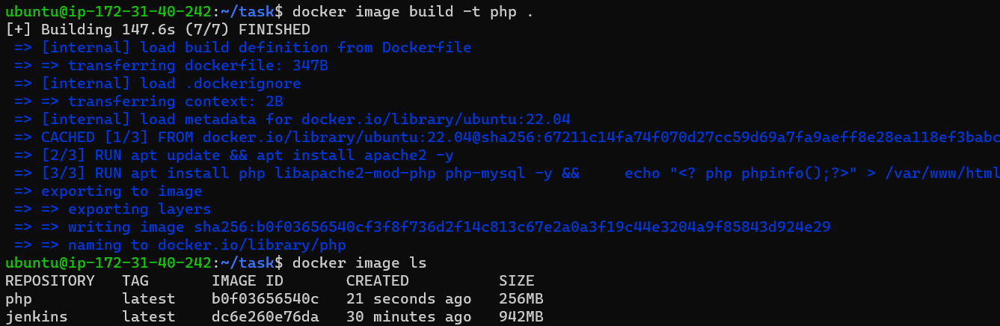
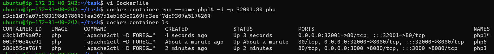
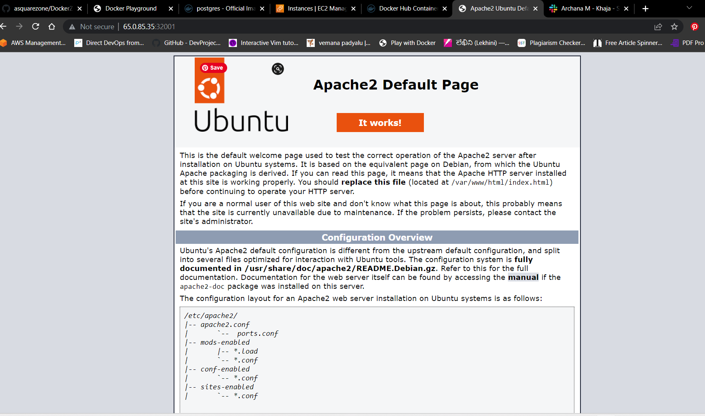

### create an alpine container in interactive mode and install python.

* Let's create an alpine container in interactive mode, 
    * Take a EC2 Machine
    * Install Docker by using below commands,

  `curl -fsSL https://get.docker.com -o get-docker.sh
  sh get-docker.sh
  sudo usermod -aG docker ubuntu`

* Let's install python
   `docker container run -it alpine:latest`



### create an ubuntu container with sleep 1d and then login using exec. Install python

* Let's create an ubuntu container with sleep 1d & then login using exec. Install python
    * Take a EC2 Machine
    * Install Docker
    * Run the below command

`docker container run -it --name ubuntu ubuntu: latest sleep 1d`

* After that exit into the machine and re login.
* And execute `docker container run exec –it ubuntu bin/bash`
* Now we are inside the container, run the below commands 
 `apt update && apt install python3 && Python3 –version`



* Finally we installed python

### create an postgres container with user panoramic and password as trekking. Try login in show the database.

* Let's create an postgres container with user panoramic and password as trekking.
    * Take a EC2 Machine
    * Install Docker
    * Run the below commands

`docker container run -d -P --name pasqldb -e POSTGRES_USER=panoramic -e POSTGRES_PASSWORD=trekking -e POSTGRES_DB=psqldata postgres`

`docker container ls`

`docker exec -it pasqldb /bin/bash`



`psql -U panoramic -W trekking -d psqldata`



```
use employees;

CREATE TABLE Persons (
    PersonID int,
    LastName varchar(255),
    FirstName varchar(255),
    Address varchar(255),
    City varchar(255)
);

Insert into Persons Values (1,'Reddy','Prakash', 'Kurnool', 'AndhraPradesh');

select * from Persons;
```



### Create a Jenkins image by creating your own Dockerfile?

* Let's create an postgres container with user panoramic and password as trekking.
    * Take a EC2 Machine
    * Install Docker
    * Create a File and change the directory to that location path.
    * And create a vi Dockerfile. In that we can write Jenkins Dockerfile.
```Dockerfile
FROM ubuntu:22.04
LABEL author="Prakash Reddy" organization="qt" project="learning"
RUN apt update && apt install openjdk-11-jdk maven curl -y
RUN curl -fsSL https://pkg.jenkins.io/debian-stable/jenkins.io-2023.key | tee \
    /usr/share/keyrings/jenkins-keyring.asc > /dev/null
RUN echo deb [signed-by=/usr/share/keyrings/jenkins-keyring.asc] \
    https://pkg.jenkins.io/debian-stable binary/ | tee \
    /etc/apt/sources.list.d/jenkins.list > /dev/null
RUN apt-get update && apt-get install jenkins -y
EXPOSE 8080
CMD ["/usr/bin/jenkins"]
```
* For build the docker image by using below commands
`docker image build -t jenkins .`

`docker image ls`

`docker container run --name jenkins -d -p 3000:8080 jenkins`

`docker container ls`



* Finally we will get the Jenkins Page.



### Creating a dockerfile which runs phpinfo page , user ARG and ENV wherever appropriate.Try on apache server and Try on nginx server.

* Let's Creating a dockerfile which runs phpinfo page , user ARG and ENV wherever appropriate.
    * Take a EC2 Machine
    * Install Docker
    * Create a File and change the directory to that location path.
    * And create a vi Dockerfile. In that we can write Jenkins Dockerfile.

```Dockerfile
FROM ubuntu:22.04
LABEL author="Prakash" organization="qualitythought"
ARG DEBIAN_FRONTEND=noninteractive
RUN apt update && apt install apache2 -y
RUN apt install php libapache2-mod-php php -y && \
	echo "<? php phpinfo();?>" > /var/www/html/info.php
EXPOSE 80
CMD ["apache2ctl","-D", "FOREGROUND"]
```
* For build the docker image by using below commands
`docker image build -t jenkins .`

`docker image ls`



`docker container run --name php -d -p 32000:80 php`
`docker container ls`



* Finally we will get the apache Page.
