### Create a multi-stage docker file to build
   * nop commerce  
   * spring petclinic
   * student courses register

* Let's create a multi-stage docker file to build nop commerce, spring petclinic and student courses register.
    * Take a EC2 Machine
    * Install Docker by using below commands,

  ```
  curl -fsSL https://get.docker.com -o get-docker.sh
  sh get-docker.sh
  sudo usermod -aG docker ubuntu
  ```
* After successful installation please re-login into your machine
* After re-login try to get docker info
```
$ docker -—version
$ docker info
```
### Let's create a multi-stage docker file to build nop commerce

* create a dockerfile in `vi Dockerfile`

```Dockerfile
FROM ubuntu:22.04 As builder
RUN apt update && apt install unzip -y
ADD https://github.com/nopSolutions/nopCommerce/releases/download/release-4.40.2/nopCommerce_4.40.2_NoSource_linux_x64.zip /nop/nopCommerce_4.40.2_NoSource_linux_x64.zip
RUN cd nop && unzip nopCommerce_4.40.2_NoSource_linux_x64.zip && rm nopCommerce_4.40.2_NoSource_linux_x64.zip

FROM mcr.microsoft.com/dotnet/sdk:7.0
LABEL author="Prakash Reddy" organization="qt" project="learning"
ARG HOME_DIR=/nop-bin
WORKDIR ${HOME_DIR}
COPY --from=builder /nop ${HOME_DIR}
EXPOSE 5000
CMD [ "dotnet", "Nop.Web.dll", "--urls", "http://0.0.0.0:5000" ]
```
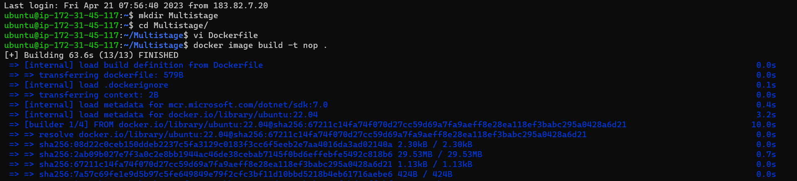

* To build the docker image by using command `docker image build -t (imagename) nop .`

* To check the docker image creation by using command `docker image ls`

* To run the docker container by using command `docker container run --name nop -d -p 32000:5000 nop `

* To check the docker container creation by using command `docker container ls`

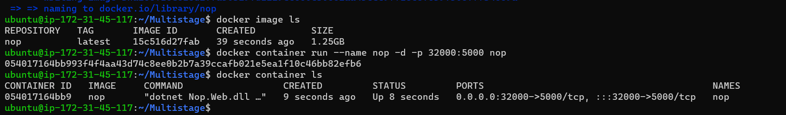

* To check the nopcommerce web page use the `http://<publicip>:5000` and We will get the nopCommerce Page.

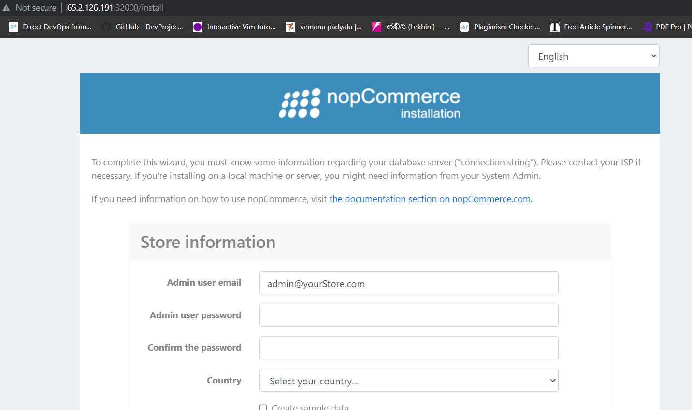

### Push these images to Amazon Elastic Container Registry

* Create AWS Configuration, to do this install AWS CLI `sudo apt install awscli`

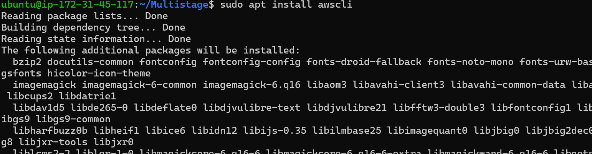

`aws configure`

* For aws configuration use your 
     * AWS Access Key ID
     * AWS Secret Access Key 
     * Default region name.
  
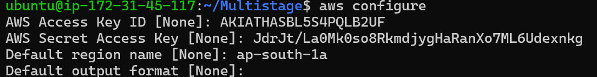

* Create Amazon Elastic Container Registry.
     * In that you can use Public Repository are else Private Repository

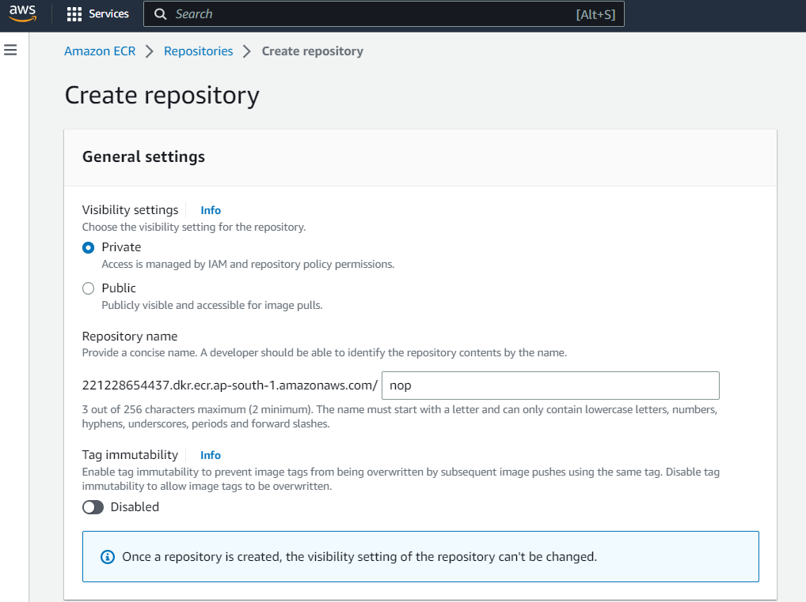
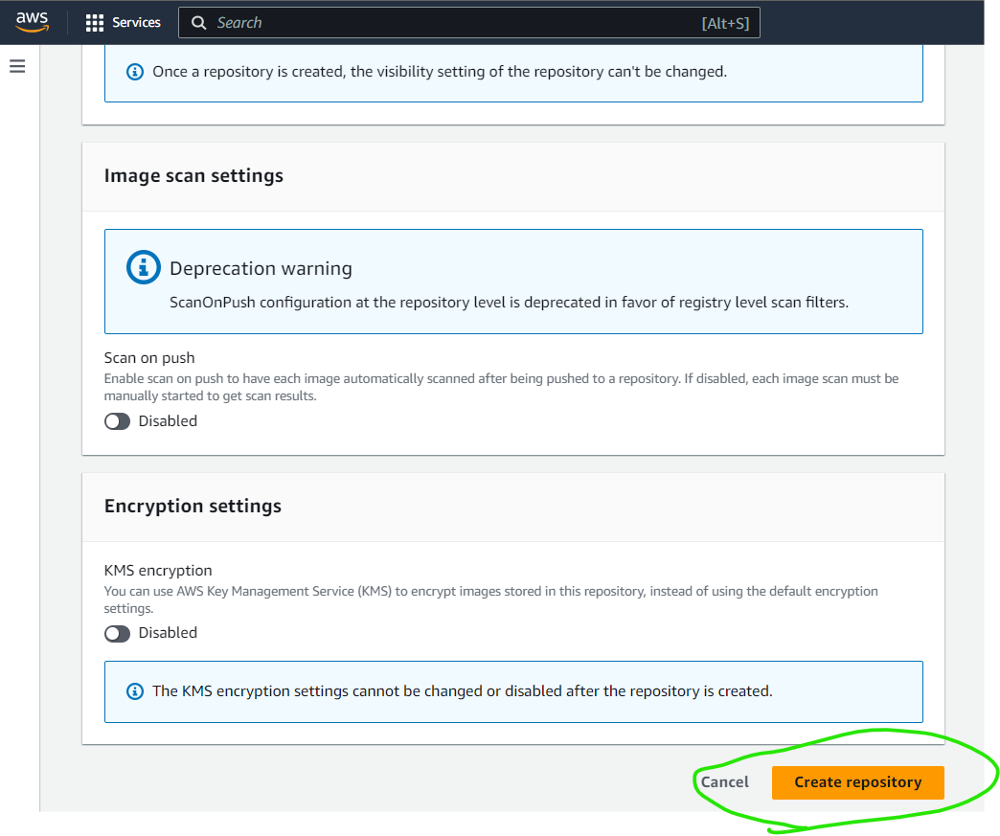
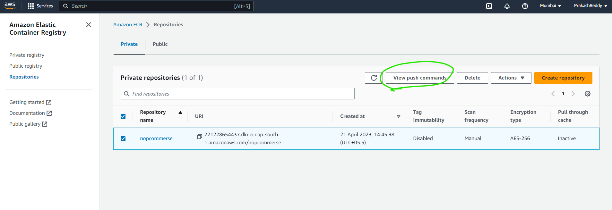
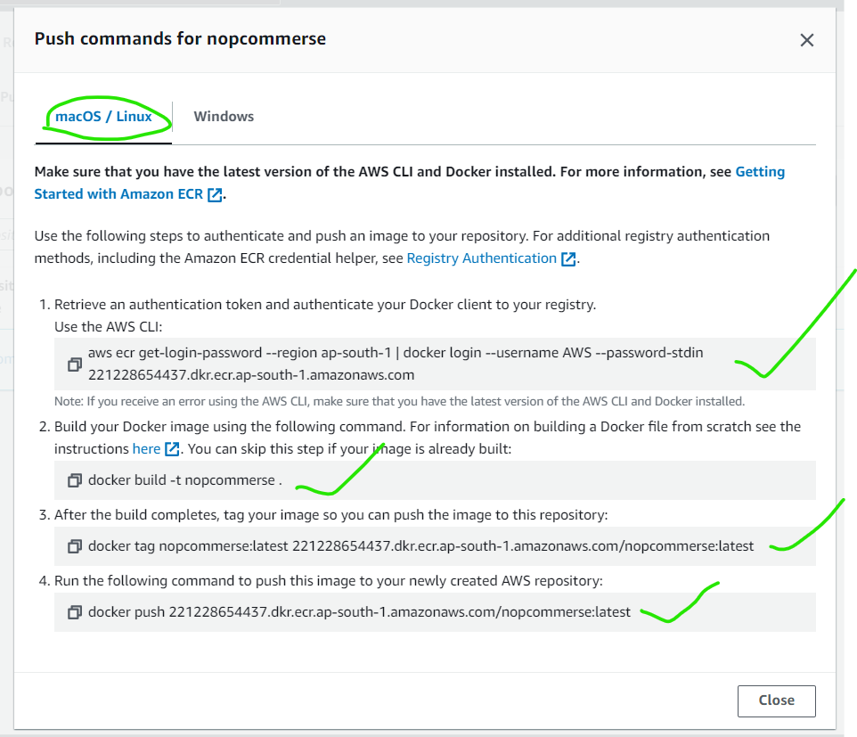

* In that Elastic Container Registry you can Use view Push Commands

```
aws ecr get-login-password --region ap-south-1 | docker login --username AWS --password-stdin 221228654437.dkr.ecr.ap-south-1.amazonaws.com
```
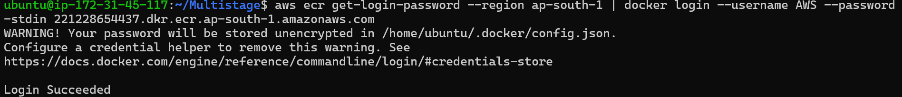

```
docker build -t nopcommerse .
docker tag nopcommerse:latest 221228654437.dkr.ecr.ap-south-1.amazonaws.com/nopcommerse:latest
docker push 221228654437.dkr.ecr.ap-south-1.amazonaws.com/nopcommerse:latest
```
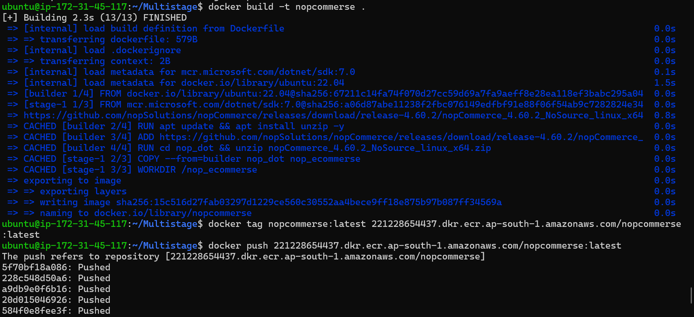
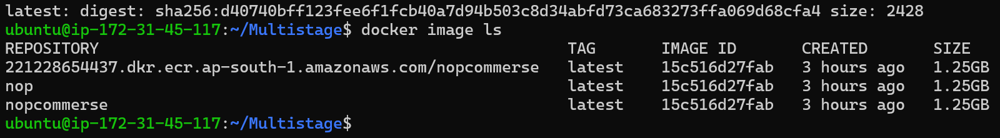

* Finally you will create an a Image in Elastic Container Registry.

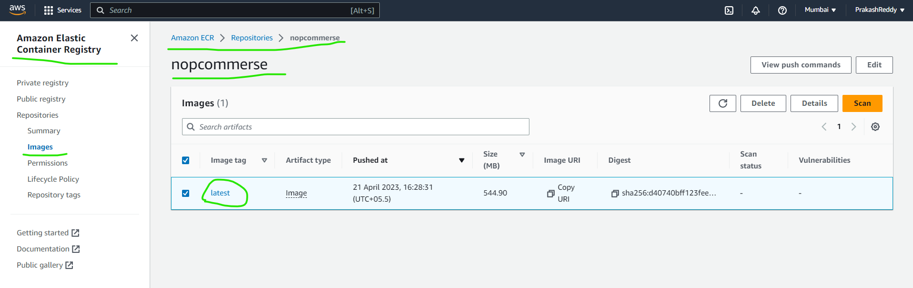

### Write a docker compose file for Nop Commerce.

* Write a docker compose file for Nop Commerce

```yaml
---
version: "3.9"
services:
  nop:
    build:
      context: .
      dockerfile: Dockerfile
    networks:
      - nop-net
    ports:
      - "32000:5000"
    depends_on:
      - nop-db
      
  nop-db:
    image: mysql:8
    networks:
      - nop-net
    volumes:
      - nop-db:/var/lib/mysql
    environment:
      - MYSQL_ROOT_PASSWORD=prakashprakash
      - MYSQL_USER=nop
      - MYSQL_PASSWORD=prakashprakash
      - MYSQL_DATABASE=nop
volumes:
  nop-db:
networks:
  nop-net:
```
* To run the docker compose command is `docker compose up -d`

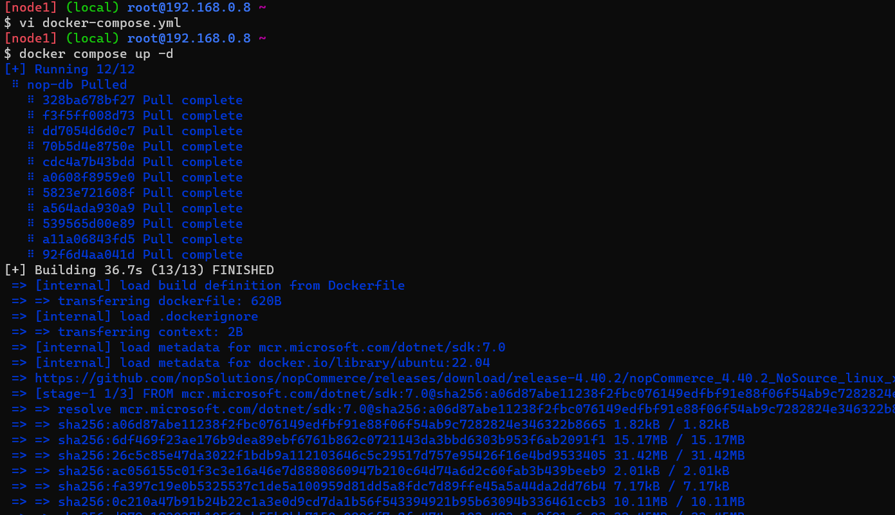

* To check the docker container creation by using command `docker container ls`

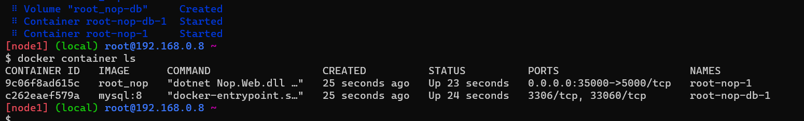

* To check the nopcommerce web page use the `http://<publicip>:5000`

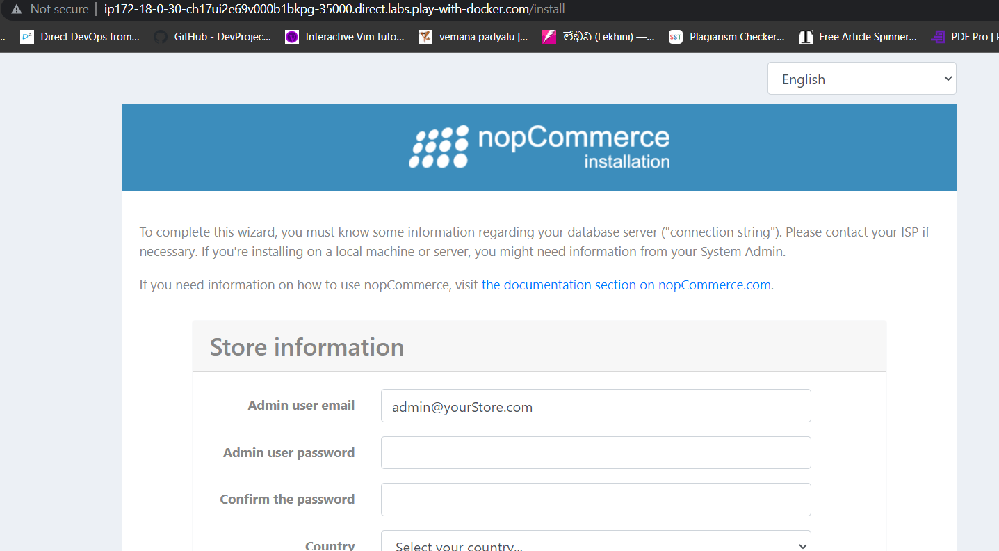

### Let's create a multi-stage docker file to build spring petclinic

* Take a EC2 Machine
    * Install Docker by using below commands,

  ```
  curl -fsSL https://get.docker.com -o get-docker.sh
  sh get-docker.sh
  sudo usermod -aG docker ubuntu
  ```
* After successful installation please re-login into your machine
* After re-login try to get docker info
```
$ docker -—version
$ docker info
```

```Dockerfile
FROM alpine/git AS vcs
RUN cd / && git clone https://github.com/spring-projects/spring-petclinic.git && \
    pwd && ls /spring-petclinic

FROM maven:3-amazoncorretto-17 AS builder
COPY --from=vcs /spring-petclinic /spring-petclinic
RUN ls /spring-petclinic 
RUN cd /spring-petclinic && mvn package

FROM amazoncorretto:17-alpine-jdk
LABEL author="Prakash Reddy" organization="qt" project="learning"
EXPOSE 8080
ARG HOME_DIR=/spc
WORKDIR ${HOME_DIR}
COPY --from=builder /spring-petclinic/target/spring-*.jar ${HOME_DIR}/spring-petclinic.jar
EXPOSE 8080
CMD ["java", "-jar", "spring-petclinic.jar"]
```
* create a dockerfile in `vi Dockerfile`

* To build the docker image by using command `docker image build -t spc .`

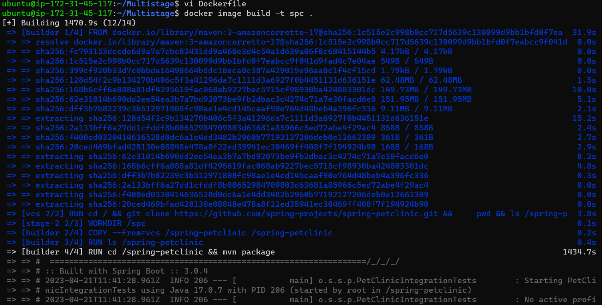