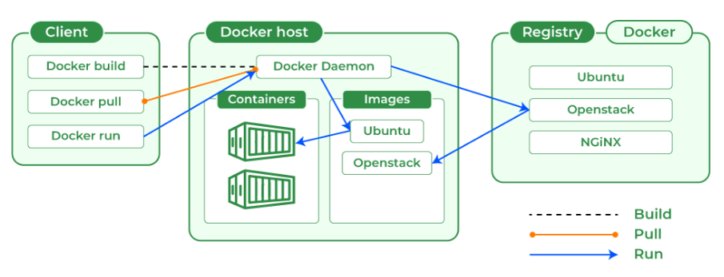

Introduction to Docker
------------------------
* Docker is a set of platforms as a service (PaaS) products that use the Operating system level visualization to deliver software in packages called containers.
* Containers are isolated from one another and bundle their own software, libraries, and configuration files; they can communicate with each other through well-defined channels.
* All containers are run by a single operating system kernel and therefore use fewer resources than a virtual machine.

## Important Terminologies in Docker

### Docker Image
* It is a file, comprised of multiple layers, used to execute code in a Docker container.
* They are a set of instructions used to create docker containers.

### Docker Container
* It is a runtime instance of an image.
* Allows developers to package applications with all parts needed such as libraries and other dependencies.

### Docker file
* It is a text document that contains necessary commands which on execution helps assemble a Docker Image.
* Docker image is created using a Docker file.

### Docker Engine
* The software that hosts the containers is named Docker Engine.
* Docker Engine is a client-server based application
* The docker engine has 3 main components:
  * Server: It is responsible for creating and managing Docker images, containers, networks, and volumes on the Docker. It is referred to as a daemon process.
  * REST API: It specifies how the applications can interact with the Server and instructs it what to do.
  * Client: The Client is a docker command-line interface (CLI), that allows us to interact with Docker using the docker commands.
### Docker Hub
* Docker Hub is the official online repository where you can find other Docker Images that are available for use.
* It makes it easy to find, manage, and share container images with others.

### Installing Docker on Ubuntu
```bash
curl -fsSL https://get.docker.com -o get-docker.sh
sh get-docker.sh
sudo usermod -aG docker ubuntu
```
* After successful installation re-login into your machine
* After re-login try to get docker info `$ docker info`


Docker architecture
---------------------
[Refer Here](https://docs.docker.com/get-started/overview/#docker-architecture) for docker architecture offical docs


### What is Docker Daemon?
* Docker daemon manages all the services by communicating with other daemons.
* It manages docker objects such as images, containers, networks, and volumes with the help of the API requests of Docker.

### Docker Client
* The Docker client is the primary way that many Docker users interact with Docker.
* When you use commands such as docker run, the client sends these commands to dockerd, which carries them out.
* The docker command uses the Docker API.
* The Docker client can communicate with more than one daemon.
  
### Docker Host
* Docker Host is used to provide an environment to execute and run applications.
* It contains the docker daemon, images, containers, networks, and storage.

### Docker Registry
* All the docker images are stored in the docker registry.
* There is a public registry which is known as a docker hub that can be used by anyone.
* We can run our private registry also. 
* With the help of docker run or docker pull commands.
* we can pull the required images from our configured registry.
* Images are pushed into configured registry with the help of the docker push command.