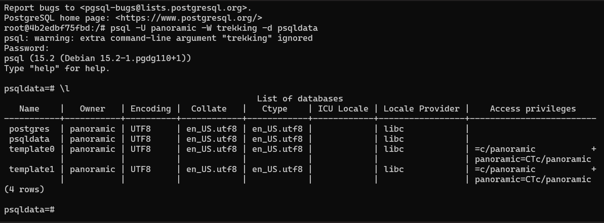

### create an alpine container in interactive mode and install python.

* Let's create an alpine container in interactive mode, 
    * Take a EC2 Machine
    * Install Docker by using below commands,

  ```
  curl -fsSL https://get.docker.com -o get-docker.sh
  sh get-docker.sh
  sudo usermod -aG docker ubuntu
  ```
* After successful installation please re-login into your machine
* After re-login try to get docker info
```
$ docker -—version
$ docker info
```
* Let's install python
   `docker container run -it alpine:latest`


### create an ubuntu container with sleep 1d and then login using exec. Install python

* Let's create an ubuntu container with sleep 1d & then login using exec. Install python
    * Take a EC2 Machine
    * Install Docker
    * Run the below command

`docker container run -it --name ubuntu ubuntu: latest sleep 1d`

* After that exit into the machine and re login.
* And execute `docker container run exec –it ubuntu bin/bash`
* Now we are inside the container, run the below commands 
 `apt update && apt install python3 && Python3 –version`


* Finally we installed python

### create an postgres container with user panoramic and password as trekking. Try login in show the database.

* Let's create an postgres container with user panoramic and password as trekking.
    * Take a EC2 Machine
    * Install Docker
    * Run the below commands

```
docker container run -d -P --name pasqldb -e POSTGRES_USER=panoramic -e POSTGRES_PASSWORD=trekking -e POSTGRES_DB=psqldata postgres

docker container ls

docker exec -it pasqldb /bin/bash
```


`psql -U panoramic -W trekking -d psqldata`



```
use employees;

CREATE TABLE Persons (
    PersonID int,
    LastName varchar(255),
    FirstName varchar(255),
    Address varchar(255),
    City varchar(255)
);

Insert into Persons Values (1,'Reddy','Prakash', 'Kurnool', 'AndhraPradesh');

select * from Persons;
```


### Create a Jenkins image by creating your own Dockerfile?

* Let's create an postgres container with user panoramic and password as trekking.
    * Take a EC2 Machine
    * Install Docker
    * Create a File and change the directory to that location path.
    * And create a vi Dockerfile. In that we can write Jenkins Dockerfile.
```Dockerfile
FROM ubuntu:22.04
LABEL author="Prakash Reddy" organization="qt" project="learning"
RUN apt update && apt install openjdk-11-jdk maven curl -y
RUN curl -fsSL https://pkg.jenkins.io/debian-stable/jenkins.io-2023.key | tee \
    /usr/share/keyrings/jenkins-keyring.asc > /dev/null
RUN echo deb [signed-by=/usr/share/keyrings/jenkins-keyring.asc] \
    https://pkg.jenkins.io/debian-stable binary/ | tee \
    /etc/apt/sources.list.d/jenkins.list > /dev/null
RUN apt-get update && apt-get install jenkins -y
EXPOSE 8080
CMD ["/usr/bin/jenkins"]
```
* For build the docker image by using below commands
`docker image build -t jenkins .`

`docker image ls`

`docker container run --name jenkins -d -p 3000:8080 jenkins`

`docker container ls`


* Finally we will get the Jenkins Page.


### Creating a dockerfile which runs phpinfo page , user ARG and ENV wherever appropriate.Try on apache server.

* Let's Creating a dockerfile which runs phpinfo page , user ARG and ENV wherever appropriate.
    * Take a EC2 Machine
    * Install Docker
    * Create a File and change the directory to that location path.
    * And create a vi Dockerfile. In that we can write php Dockerfile.

```Dockerfile
FROM ubuntu:22.04
LABEL author="Prakash" organization="qualitythought"
ARG DEBIAN_FRONTEND=noninteractive
RUN apt update && apt install apache2 -y
RUN apt install php libapache2-mod-php php -y && \
	echo "<?php phpinfo() ?>" >> /var/www/html/info.php
EXPOSE 80
CMD ["apache2ctl","-D", "FOREGROUND"]
```
* For build the docker image by using below commands
`docker image build -t php .`

`docker image ls`


`docker container run --name php -d -p 32000:80 php`
`docker container ls`


* Finally we will get the apache & php Page.
 


### Creating a dockerfile which runs phpinfo page , user ARG and ENV wherever appropriate. Try on nginx server.

* On nginx Server
    * Take a EC2 Machine
        * Install Docker
        * Create a File and change the directory to that location path.
        * And create a vi Dockerfile. In that we can write nginx Dockerfile.
  
```Dockerfile
# Base image
FROM ubuntu:22.04
LABEL author="Prakash" organization="qualitythought"
# Define variables
ARG DEBIAN_FRONTEND=noninteractive
# Install nginx and other required packages
RUN apt update && apt install nginx -y
RUN apt install php8.1-fpm -y
RUN chmod -R 777 /var/www/html
RUN	echo "<? php phpinfo();?>" > /var/www/html/info.php
RUN service nginx restart
# Expose port 80
EXPOSE 80
# Start Nginx and PHP-FPM
CMD ["nginx","-g", "daemon off;"]
```
* For build the docker image by using below commands
```
docker image build -t nginx .
docker image ls
docker container run --name nginx -d -p 3000:80 nginx
docker container ls
```


* Finally we will get the nginx Page.


### create nop commerce and mysql server containers and try to make them work


```Dockerfile
FROM mcr.microsoft.com/dotnet/sdk:7.0
LABEL author="Prakash" organization="qt" project="learning"
ADD https://github.com/nopSolutions/nopCommerce/releases/download/release-4.60.2/nopCommerce_4.60.2_NoSource_linux_x64.zip /nop/nopCommerce_4.60.2_NoSource_linux_x64.zip
WORKDIR /nop
RUN apt update && apt install unzip -y && \
    unzip /nop/nopCommerce_4.60.2_NoSource_linux_x64.zip && \
    mkdir /nop/bin && mkdir /nop/logs
EXPOSE 5000
CMD [ "dotnet", "Nop.Web.dll","--urls", "http://0.0.0.0:5000" ]
```


```
docker volume create my_vo

docker network create my_network

docker container run -d --name mysqldb -v my_vo:/var/lib/mysql -e MYSQL_ROOT_PASSWORD=rootroot -e MYSQL_DATABASE=employees -e MYSQL_USER=qtdevops -e MYSQL_PASSWORD=rootroot -P --network my_network mysql:8

docker container exec -it mysqldb mysql --password=rootroot
```
```
use employees;

CREATE TABLE Persons (
    PersonID int,
    LastName varchar(255),
    FirstName varchar(255),
    Address varchar(255),
    City varchar(255)
);

Insert into Persons Values (1,'Reddy','Prakash', 'Kurnool', 'AndhraPradesh');

select * from Persons;
```


`docker container run -d --name nop1 -e MYSQL_SERVER=mysql --network my_network -P nop`

