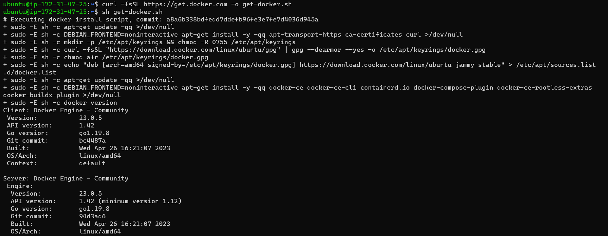

### Explain Kubernetes architecture

Kubernetes Architecture
------------------------


### Pod

* A group of one or more containers.The smallest unit of k8s.The container has no ip address Pod has an IP address.
* If the pod fails, then that pod will not be created again, another new pod will be created and its IP will be different.

### kubelet 

* Kublet is a small, lightweight Kubernetes node agent that runs on each node in a Kubernetes cluster.
* It's responsible for managing the nodes and communicating with the Kubernetes master. 
* It's also responsible for making sure that the containers running on the nodes are healthy and running correctly.
### Kube-proxy

* Kube-proxy is a network proxy service for Kubernetes that is responsible for routing traffic to different services within the cluster.
* It is responsible for forwarding traffic from one service to another, allowing for communication between different components of the Kubernetes cluster.
### Service

* In Kubernetes, a service is an object that abstracts the underlying infrastructure and provides a unified access point for the applications that are running on the cluster. 
* Services allow the applications to communicate with each other and are used to provide load balancing and service discovery.

### cluster

* In Kubernetes, a cluster is a set of nodes (physical or virtual machines) that are connected and managed by the Kubernetes software.

### Container Engine(Docker, Rocket, ContainerD)

* A container engine is a software system that enables applications and services to be packaged and run in an isolated environment.
* Docker, Rocket, and Container are all examples of container engines that are used to run applications in containers.

### API Server (Application Programeble Interface)

* The API Server is the entry point of K8S Services. 
* The Kubernetes API server receives the REST commands which are sent by the user. 
* After receiving them, it validates the REST requests, processes them, and then executes them. After the execution of REST commands, the resulting state of a cluster is saved in 'etcd' as a distributed key-value store. 
* This API server is meant to scale automatically as per load.

### ETCD

etcd is a `consistent and highly-available key value store` used as Kubernetes’ backing store for all cluster data. If your Kubernetes cluster uses etcd as its backing store, make sure you have a back up plan for those data. You can find in-depth information about etcd in the official documentation.

### Controller Manager

* The Kubernetes Controller Manager (also called kube-controller-manager) is a daemon that acts as a `continuous control loop` in a Kubernetes cluster. 
* The controller monitors the current state of the cluster via calls made to the API Server and changes the `current state to match the desired state` described in the cluster’s declarative configuration.

### Scheduler

* The scheduler in a master node schedules the tasks for the worker nodes. 
* And, for every worker node, it is used to store the resource usage information.

### What is kubectl stand for?

* Kubectl stands for `Kubernetes Command-line interface`. It is a command-line tool for the Kubernetes platform to perform API calls.
* Kubectl is the main interface that allows users to create (and manage) individual objects or groups of objects inside a Kubernetes cluster.

Kubernetes resources are defined by a `manifest` file written in `YAML`. When the manifest is deployed, an object is created `that aims to reach the desired state within the cluster`. From that point, the appropriate controller watches the object and `updates the cluster’s existing state to match the desired state`.

[Refer Here](https://safiakhatoon.hashnode.dev/kubernetes-architecture-and-components-kubernetes-installation-and-configuration) for the Kubernetes architecture and installation steps.

### Setup k8s on single node using minikube, kind and Run the Spring Pet Clinic

* Installing kubectl and minikube on Ubuntu
    * Install kubectl by using below commands
```bash
curl -LO "https://dl.k8s.io/release/$(curl -L -s https://dl.k8s.io/release/stable.txt)/bin/linux/amd64/kubectl"
sudo install -o root -g root -m 0755 kubectl /usr/local/bin/kubectl
kubectl version
```


* This downloads the latest stable release of kubectl for Linux amd64 architecture, installs it, and verifies the installation.

* Install minikube
```
curl -LO https://storage.googleapis.com/minikube/releases/latest/minikube-linux-amd64
sudo install minikube-linux-amd64 /usr/local/bin/minikube
minikube start --driver=docker
```


* This downloads the latest release of minikube for Linux amd64 architecture, installs it, and starts a single-node Kubernetes cluster using the Docker driver.

* Let's create a pod configuration file: vi spc.yml

* This opens a new file in the vi text editor.

* Paste the following YAML code into the file and save it

```yaml
---
apiVersion: v1
kind: Pod
metadata:
  name: spring-petclinic
spec:
  containers:
    - name: spring-petclinic
      image: prakashreddy2525/spc
      ports:
        - containerPort: 8080
```
* This defines a Kubernetes pod called 'spring-petclinic' that runs a container using the prakashreddy2525/spc image and exposes port 8080.

* Let's create pod
```
kubectl create -f spc.yml
kubectl get pods
kubectl get pods -o wide
```


* This creates the 'spring-petclinic' pod using the configuration in the spc.yml file, lists the running pods, and shows additional details about the 'spring-petclinic' pod.

* Verify the pod is running
```
minikube ssh
curl http://<cluster-ip>:8080
```


* This logs into the minikube VM, where the Kubernetes cluster is running, and uses curl to access the spring-petclinic web server running in the 'spring-petclinic' pod via the cluster IP address.

* Delete the pod `kubectl delete pod spring-petclinic`

* This deletes the 'spring-petclinic' pod from the Kubernetes cluster.

### Setup k8s on single node using kind and Run the Spring Pet Clinic.

* Let's Install Kind, we need Docker, GO and Kubectl.

* Install docker using below steps,
```
curl -fsSL https://get.docker.com -o get-docker.sh
sh get-docker.sh
sudo usermod -aG docker ubuntu
```
* After successful installation re-login into your machine
* After re-login try to get docker info `$ docker info`



* Install GO
```
wget https://storage.googleapis.com/golang/getgo/installer_linux
chmod +x ./installer_linux
./installer_linux
source ~/.bash_profile
```


* Install kubectl by usind command `sudo snap install kubectl --classic`

* Install Kind
```
curl -Lo ./kind "https://kind.sigs.k8s.io/dl/v0.18.0/kind-$(uname)-amd64"
chmod +x ./kind
sudo mv ./kind /usr/local/bin/kind
```


* Let's create the cluster in Kind
```
kind create cluster
kind get clusters && kubectl cluster-info --context kind-kind
```


* Let's create
```
kubectl apply -f spc.yaml
kubectl get po
kubectl get po -o wide
kubectl get po -w
```
