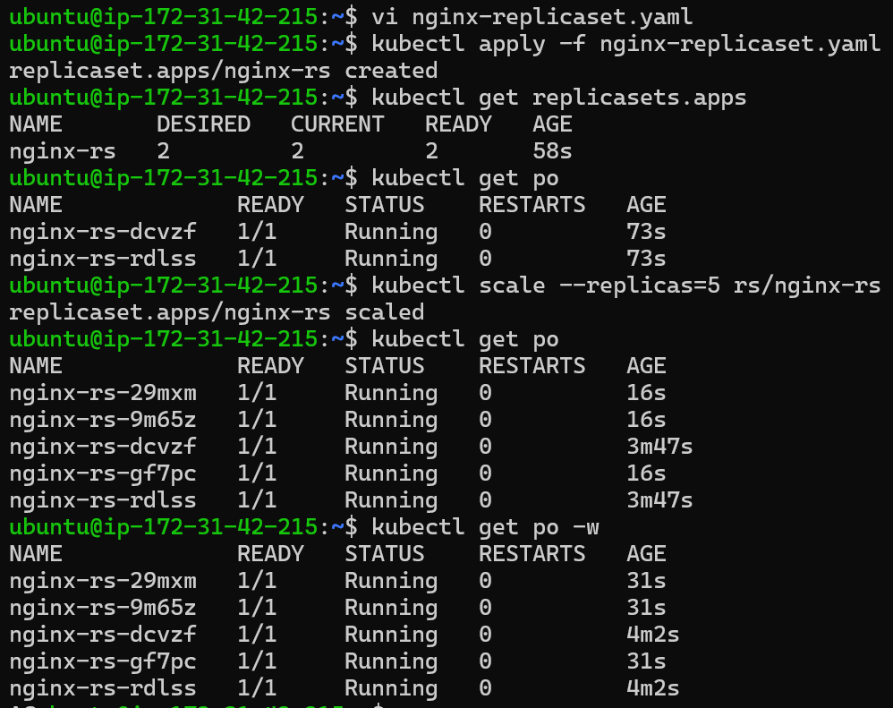

### Creating the ReplicaSet for nginx

* Create a YAML file for the ReplicaSet of nginx configuration `vi nginx-replicaset.yaml`

```
---
apiVersion: apps/v1
kind: ReplicaSet
metadata:
  name: nginx-rs
  labels:
    app: nginx
    version: "1.23.0"
spec:
  minReadySeconds: 3
  replicas: 2
  selector:
    matchLabels:
      app: nginx
      version: "1.23.0"
  template:
    metadata:
      labels:
        app: nginx
        version: "1.23.0"
        size: large
    spec:
      containers:
        - name: nginx
          image: nginx:1.23.0
          ports:
            - containerPort: 80
          livenessProbe:
            exec: 
              command: 
                - pwd
          readinessProbe:
            httpGet:
              path: /
              port: 80
            initialDelaySeconds: 2
            periodSeconds: 3
```
* The ReplicaSet is named "nginx-replicaset", and it is configured to have 3 replicas.
* The selector is set to match the label "app: nginx", and the template is configured to create a container running the latest version of the nginx image on port 80.
* Apply the YAML file using the kubectl command ` kubectl apply -f nginx-replicaset.yaml`
* Verify that the ReplicaSet is running by using the following command `kubectl get replicasets.apps`
* This will display a list of all the ReplicaSets running on your cluster.
* You should see the "nginx-replicaset" ReplicaSet listed, along with the number of replicas that are currently running.

```
kubectl apply -f nginx-replicaset.yaml
kubectl get replicasets.apps
kubectl get po
kubectl scale --replicas=5 rs/nginx-rs
kubectl get po
kubectl get po -w
kubectl delete pods --all
```



### Creating the ReplicaSet for jenkins

* Create a YAML file for the ReplicaSet of nginx configuration `vi jenkins-Replicaset.yaml`
```
---
apiVersion: apps/v1
kind: ReplicaSet
metadata:
  name: jenkins-rs
spec:
  minReadySeconds: 5
  replicas: 5
  selector:
    matchLabels:
      app: jenkins
  template:
    metadata:
      name: jenkins
      labels:
        app: jenkins
    spec:
      containers:
        - name: jenkins
          image: jenkins/jenkins:lts-jdk11
          ports:
            - containerPort: 8080
        - name: alpine
          image: alpine:3
          args:
            - sleep
            - 1d
```
* The ReplicaSet is named "jenkins-Replicaset", and it is configured to have 3 replicas.
* The selector is set to match the label "app: jenkins", and the template is configured to create a container running the latest version of the jenkins image on port 8080.
* Apply the YAML file using the kubectl command ` kubectl apply -f jenkins-Replicaset.yaml`
* Verify that the ReplicaSet is running by using the following command `kubectl get replicasets.apps`
* This will display a list of all the ReplicaSets running on your cluster.
* You should see the "jenkins-replicaset" ReplicaSet listed, along with the number of replicas that are currently running.

```
kubectl apply -f jenkins-Replicaset.yaml
kubectl get replicasets.apps
kubectl get po
kubectl scale --replicas=5 rs/jenkins-rs
kubectl get po
kubectl get po -w
kubectl delete pods --all
```