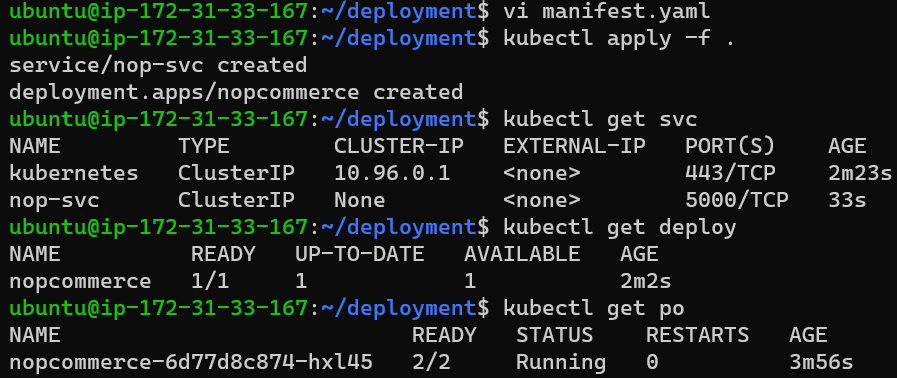

### Create a MySQL pod with Stateful Set with 1 replica
```yaml
---
apiVersion: v1
kind: Service
metadata:
  name: mysql-svc
spec:
  selector:
    app: mysql
  ports:
    - name: mysql
      port: 3306
      targetPort: 3306
      protocol: TCP
---
apiVersion: apps/v1
kind: StatefulSet
metadata:
  name: mysql-svc
  labels:
    app: 'mysql'
spec:
  minReadySeconds: 2
  replicas: 1
  serviceName: mysql-svc
  selector:
    matchLabels:
      app: 'mysql'
  template:
    metadata:
      name: mysql-pod
      labels:
        app: 'mysql'
    spec:
      containers:
        - name: mysql
          image: mysql:8
          ports:
            - containerPort: 3306
          env:
            - name: MYSQL_ROOT_PASSWORD
              value: prakash
            - name: MYSQL_USER
              value: prakash
            - name: MYSQL_PASSWORD
              value: prakash
            - name: MYSQL_DATABASE
              value: employees
          volumeMounts:
            - name: mysql-volume
              mountPath: /var/lib/mysql
      volumes:
        - name: mysql-volume
          emptyDir:
            sizeLimit: 100Mi    
```


### Create a nopCommerce deployment with 1 replica

```yaml
---
apiVersion: v1
kind: Service
metadata:
  name: nop-svc
spec:
  selector:
    app: nop
  ports:
    - name: nop
      port: 5000
      targetPort: 5000
      protocol: TCP
  externalIPs:
     - 198.51.100.32
---
apiVersion: apps/v1
kind: Deployment
metadata:
  name: nopcommerce
spec:
  minReadySeconds: 10
  replicas: 1
  selector:
    matchLabels:
      app: nopcommerce
  template:
    metadata:
      labels:
        app: nopcommerce
    spec:
      containers:
      - name: nop
        image: prakashreddy2525/nopcommerce
        resources:
          limits:
            memory: "128Mi"
            cpu: "500m"
        ports:
        - containerPort: 5000
        env:
            - name: MYSQL_ROOT_PASSWORD
              value: prakash
            - name: MYSQL_USER
              value: prakash
            - name: MYSQL_PASSWORD
              value: prakash
            - name: MYSQL_DATABASE
              value: employees
```


### Create a Headless Service to interact with nopCommerce with MySQL

```yaml
### Headless Service
---
apiVersion: v1
kind: Service
metadata:
  name: nop-svc
spec:
  selector:
    app: nopCommerce
  type: ClusterIp
  clusterIP: None
  ports:
    - name: nop-svc
      port: 5000
      targetPort: 5000
      protocol: TCP
---
apiVersion: apps/v1
kind: Deployment
metadata:
  name: nopcommerce
spec:
  minReadySeconds: 10
  replicas: 1
  selector:
    matchLabels:
      app: nopcommerce
  strategy:
    type: RollingUpdate    
  template:
    metadata:
      labels:
        app: nopcommerce
    spec:
      containers:
      - name: nop
        image: prakashreddy2525/nopcommerce
        ports:
          - containerPort: 5000
      - name: mysql
        image: mysql:8
        ports:
          - containerPort: 3306
        env:
          - name: MYSQL_ROOT_PASSWORD
            value: prakash
          - name: MYSQL_USER
            value: prakash
          - name: MYSQL_PASSWORD
            value: prakash
          - name: MYSQL_DATABASE
            value: employees
```


### Create a Load Balancer to expose the nopCommerce to External World

```yaml
---
apiVersion: apps/v1
kind: Deployment
metadata:
  name: nop-deploy
  labels:
    app: nop
spec:
  minReadySeconds: 1
  replicas: 1
  selector:
    matchLabels:
      app: nop
  strategy:
    type: RollingUpdate
  template:
    metadata:
      name: nop-pod
      labels:
        app: nop
    spec:
      containers:
        - name: nopcommerce
          image: prakashreddy2525/nopcommerce
          ports:
            - containerPort: 5000
          env:
            - name: MYSQL_SERVER
              value: mysql
---
apiVersion: v1
kind: Service
metadata:
  name: nop-svc
spec:
  type: LoadBalancer
  selector:
    app: nop
  ports:
    - port: 3000
      protocol: TCP
      targetPort: 5000
```