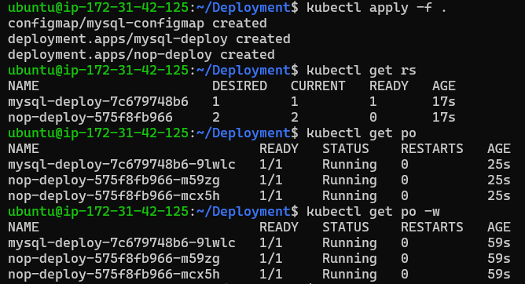
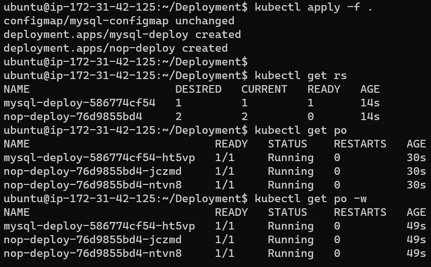
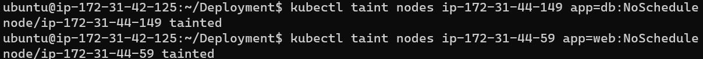
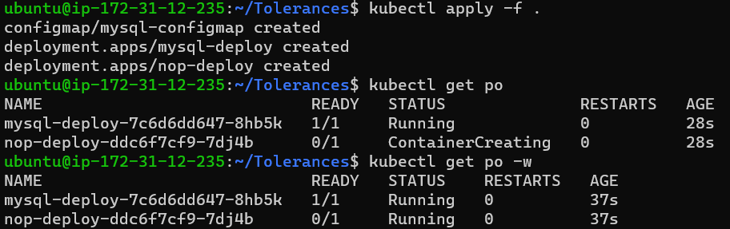

### Create 1 master node and 2 worker nodes – run app on node1 and db on node2 by using
A. Node selector
B. Affinity
C. Taints and tolerances

* creating kubeadm cluster with 2 nodes
* added labels for nodes as node1 and node2


* write manifest files for app to select `node1` and db to select `node2`

A. Node selector

* Nop-Deployment
```yaml
### NopCommerce Deployment File with NodeSelector
---
apiVersion: apps/v1
kind: Deployment
metadata: 
  name: nop-deploy
  labels:
    app: nopcommerce
spec: 
  minReadySeconds: 1
  replicas: 2
  selector: 
    matchLabels: 
      app: nopcommerce
  strategy:
    rollingUpdate:
      maxSurge: 50%
      maxUnavailable: 50%
    type: RollingUpdate  
  template:
    metadata:
      name: nop-pod
      labels:
        app: nopcommerce
    spec:
      nodeSelector:
        nodename: node1
      containers:
        - name: nopcommerce
          image: prakashreddy2525/nopcommerce
          ports:
            - containerPort: 5000
              protocol: TCP
          readinessProbe:
            httpGet:
              path: /
              port: 5000
          livenessProbe:
            tcpSocket:
              port: 5000
```

* mysql-Deployment

```yaml
### Mysql Deployment File with NodeSelector
---
apiVersion: apps/v1
kind: Deployment
metadata:
  name: mysql-deploy
spec:
  minReadySeconds: 3
  replicas: 1
  selector:
    matchLabels:
      app: mysql
  strategy:
    type: RollingUpdate
    rollingUpdate:
      maxSurge: 50%
      maxUnavailable: 50%
  template:
    metadata:
      name: mysql-pod
      labels:
        app: mysql
    spec:
      nodeSelector:
        nodename: node2
      containers:
        - name: mysql
          image: mysql:8
          ports:
            - containerPort: 3306
          envFrom:
            - configMapRef:
                name: mysql-configmap
                optional: false
### ConfigMap file
---
apiVersion: v1
kind: ConfigMap
metadata:
  name: mysql-configmap
data:
  MYSQL_ROOT_PASSWORD: prakashreddy
  MYSQL_DATABASE: employees
  MYSQL_USER: prakashreddy
  MYSQL_PASSWORD: prakashreddy
```



B. Affinity

* NopCommerce

```yaml
### NopCommerce Deployment File with Affinity
---
apiVersion: apps/v1
kind: Deployment
metadata: 
  name: nop-deploy
  labels:
    app: nopcommerce
spec: 
  minReadySeconds: 1
  replicas: 2
  selector: 
    matchLabels: 
      app: nopcommerce
  strategy:
    rollingUpdate:
      maxSurge: 50%
      maxUnavailable: 50%
    type: RollingUpdate  
  template:
    metadata:
      name: nop-pod
      labels:
        app: nopcommerce
    spec:
      affinity:
        nodeAffinity:
          requiredDuringSchedulingIgnoredDuringExecution:
            nodeSelectorTerms:
              - matchExpressions:
                  - key: nodename
                    operator: In
                    values: 
                      - node1
      containers:
        - name: nopcommerce
          image: prakashreddy2525/nopcommerce
          ports:
            - containerPort: 5000
              protocol: TCP
          readinessProbe:
            httpGet:
              path: /
              port: 5000
          livenessProbe:
            tcpSocket:
              port: 5000
```
* Mysql

```yaml
### Mysql Deployment File with Affinity
---
apiVersion: apps/v1
kind: Deployment
metadata:
  name: mysql-deploy
spec:
  minReadySeconds: 3
  replicas: 1
  selector:
    matchLabels:
      app: mysql
  strategy:
    type: RollingUpdate
    rollingUpdate:
      maxSurge: 50%
      maxUnavailable: 50%
  template:
    metadata:
      name: mysql-pod
      labels:
        app: mysql
    spec:
      affinity:
        nodeAffinity:
          requiredDuringSchedulingIgnoredDuringExecution:
            nodeSelectorTerms:
              - matchExpressions:
                  - key: nodename
                    operator: In
                    values: 
                      - node2
      containers:
        - name: mysql
          image: mysql:8
          ports:
            - containerPort: 3306
          envFrom:
            - configMapRef:
                name: mysql-configmap
                optional: false
```



C. Taints and tolerences

  * We Should have to attach taints to nodes
  * kubectl taint nodes <node-name> <key=value:effect>
```
kubectl taint nodes ip-172-31-44-59 app=web:NoSchedule
kubectl taint nodes ip-172-31-44-149 app=db:NoSchedule
```


* Lets create a manifest file by writing tolerences, Here taints are opposite to selectors.
* If tolerence of app=db matches - it will not schedule in this machine

* NopCommerce

```yaml
### NopCommerce Deployment File with Tolerances
---
apiVersion: apps/v1
kind: Deployment
metadata: 
  name: nop-deploy
  labels:
    app: nopcommerce
spec: 
  minReadySeconds: 1
  replicas: 1
  selector: 
    matchLabels: 
      app: nopcommerce
  strategy:
    rollingUpdate:
      maxSurge: 50%
      maxUnavailable: 50%
    type: RollingUpdate  
  template:
    metadata:
      name: nop-pod
      labels:
        app: nopcommerce
    spec:
      tolerations:
        - key: app
          operator: Equal
          value: db
          effect: NoSchedule
      containers:
        - name: nopcommerce
          image: prakashreddy2525/nopcommerce
          ports:
            - containerPort: 5000
              protocol: TCP
          readinessProbe:
            httpGet:
              path: /
              port: 5000
          livenessProbe:
            tcpSocket:
              port: 5000
```
* Mysql

```yaml
### Mysql Deployment File with Tolerances
---
apiVersion: apps/v1
kind: Deployment
metadata:
  name: mysql-deploy
spec:
  minReadySeconds: 1
  replicas: 1
  selector:
    matchLabels:
      app: mysql
  strategy:
    type: RollingUpdate
    rollingUpdate:
      maxSurge: 50%
      maxUnavailable: 50%
  template:
    metadata:
      name: mysql-pod
      labels:
        app: mysql
    spec:
      tolerations:
        - key: app
          operator: Equal
          value: nop
          effect: NoSchedule
      containers:
        - name: mysql
          image: mysql:8
          ports:
            - containerPort: 3306
          envFrom:
            - configMapRef:
                name: mysql-configmap
                optional: false
```



# Upgrade Kubernetes cluster from version 1.25 to version 1.27

* Create k8s cluster with version 1.25 and run any deployment(nginx/any) and then upgrade cluster to version 1.27.

* we have to upgrade k8s version from 1.25 to 1.27, in that process we should have to upgrade first 1.25 version to 1.26 version after that 1.26 to 1.27 version.

* For that lets create a kubernetes cluster with kubeadm masternode and then two worker nodes
* Here we can run all the common commands of kubeadm, but with few changes.
* changes are installing kubeadm, kubectl, kubelet with specific versions.

`sudo apt install kubeadm=1.25.9-00 kubectl=1.25.9-00 kubelet=1.25.9-00 -y`

* Installing kubernetes with version of `kubeadm init --kubernetes-version "1.25.9" --pod-network-cidr "10.244.0.0/16" --cri-socket unix:///var/run/cri-dockerd.sock`

* The control plane and nodes are successfully installed k8s with v 1.25.

## Upgrading Workflow
  * upgrade primary control plane node
  * upgrade additional control plane nodes
  * upgrade worker nodes
### upgrading control plane node - Master node
* Steps are
    * Upgrade kubeadm on the Control Plane node
    * Drain the Control Plane node
    * Plan the upgrade (kubeadm upgrade plan)
    * Apply the upgrade (kubeadm upgrade apply)
    * Upgrade kubelet & kubectl on the control Plane node
    * Uncordon the Control Plane node

* upgrade control plane node
  * Determine which version to upgrade `apt update` `apt-cache madison kubeadm`
  
  * Upgrade Plan `kubeadm upgrade plan`
  
  * Updrading kubeadm tool
   ```
   apt-mark unhold kubeadm
   apt-get update
   apt-get install kubeadm=1.26.0-00
   apt-mark hold kubeadm
   ```
  * Drain control node `kubectl drain kube-adm --ignore-daemonsets --delete-local-data`
  
  * Upgrade plan and apply new version `kubeadm upgrade plan` `kubeadm upgrade apply v1.26.0`

  * Uncordon control node ` kubectl uncordon kube-adm`

  * Upgrade kubectl and kubelet and after that daemon reload and restart kubelet
  ```
  apt-mark unhold kubectl kubelet
  apt update
  apt install kubectl=1.26.0-00 kubelet=1.26.0-00 -y
  apt-mark hold kubectl kubelet
  systemctl daemon-reload
  systemctl restart kubectl
  ```