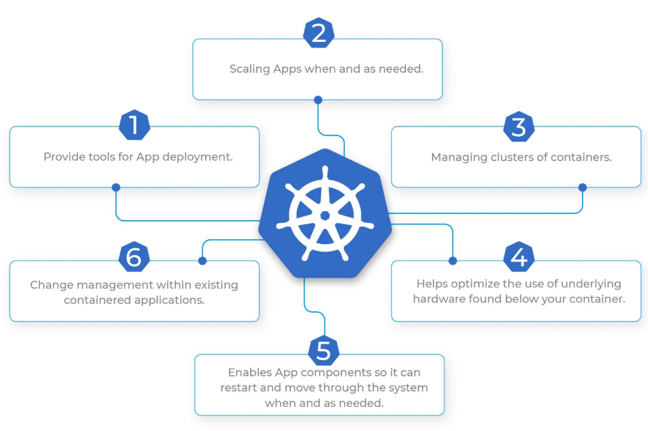
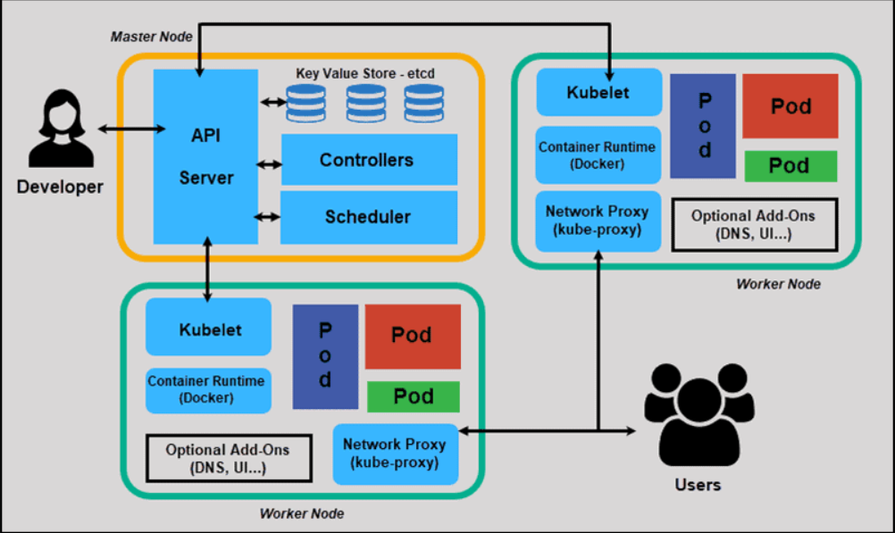
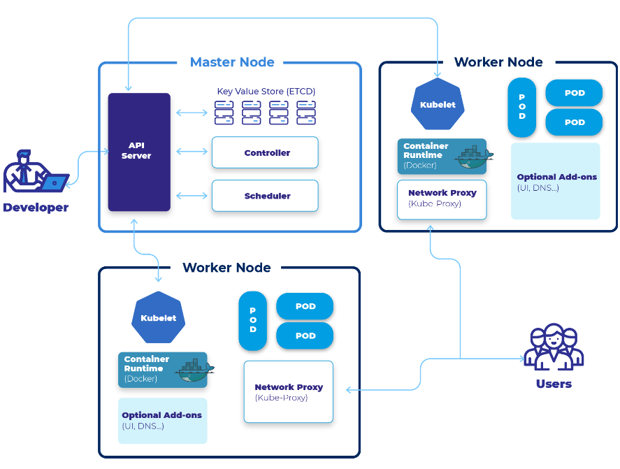
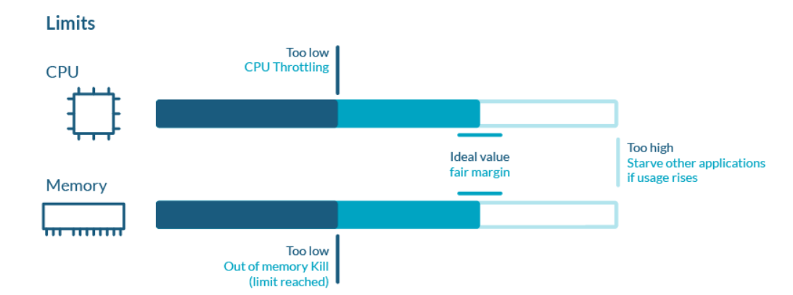

Kubernetes
-----------

* Kubernetes also known as K8s, is an open-source system for automating deployment, scaling, and management of containerized applications. 

* K8s described as `Production grade container management` 

### What Kubernetes can do?


Kubernetes Architecture
------------------------




### Pod

* A group of one or more containers.The smallest unit of k8s.The container has no ip address Pod has an IP address.
* If the pod fails, then that pod will not be created again, another new pod will be created and its IP will be different.

### kubelet 

* Kublet is a small, lightweight Kubernetes node agent that runs on each node in a Kubernetes cluster.
* It's responsible for managing the nodes and communicating with the Kubernetes master. 
* It's also responsible for making sure that the containers running on the nodes are healthy and running correctly.

### Kube-proxy

* Kube-proxy is a network proxy service for Kubernetes that is responsible for routing traffic to different services within the cluster.
* It is responsible for forwarding traffic from one service to another, allowing for communication between different components of the Kubernetes cluster.

### Service

* In Kubernetes, a service is an object that abstracts the underlying infrastructure and provides a unified access point for the applications that are running on the cluster. 
* Services allow the applications to communicate with each other and are used to provide load balancing and service discovery.

### cluster

* In Kubernetes, a cluster is a set of nodes (physical or virtual machines) that are connected and managed by the Kubernetes software.

### Container Engine(Docker, Rocket, ContainerD)

* A container engine is a software system that enables applications and services to be packaged and run in an isolated environment.
* Docker, Rocket, and Container are all examples of container engines that are used to run applications in containers.

### API Server (Application Programeble Interface)

* The API Server is the entry point of K8S Services. 
* The Kubernetes API server receives the REST commands which are sent by the user. 
* After receiving them, it validates the REST requests, processes them, and then executes them. After the execution of REST commands, the resulting state of a cluster is saved in 'etcd' as a distributed key-value store. 
* This API server is meant to scale automatically as per load.

### ETCD

etcd is a `consistent and highly-available key value store` used as Kubernetes’ backing store for all cluster data. If your Kubernetes cluster uses etcd as its backing store, make sure you have a back up plan for those data. You can find in-depth information about etcd in the official documentation.

### Controller Manager

* The Kubernetes Controller Manager (also called kube-controller-manager) is a daemon that acts as a `continuous control loop` in a Kubernetes cluster. 
* The controller monitors the current state of the cluster via calls made to the API Server and changes the `current state to match the desired state` described in the cluster’s declarative configuration.

### Scheduler

* The scheduler in a master node schedules the tasks for the worker nodes. 
* And, for every worker node, it is used to store the resource usage information.

### What is kubectl stand for?

* Kubectl stands for `Kubernetes Command-line interface`. It is a command-line tool for the Kubernetes platform to perform API calls.
* Kubectl is the main interface that allows users to create (and manage) individual objects or groups of objects inside a Kubernetes cluster.

Kubernetes resources are defined by a `manifest` file written in `YAML`. When the manifest is deployed, an object is created `that aims to reach the desired state within the cluster`. From that point, the appropriate controller watches the object and `updates the cluster’s existing state to match the desired state`.

### Namespace

* A way to organize cluster into virtual sub-cluster.

### What is difference between namespace and pod?

* A pod is a unit of replication on a cluster.
* A cluster can contain many pods, related or unrelated [and] grouped under the tight logical borders called namespaces.

### Controllers

* Controllers in k8s control/maintain state of k8s objects.

### Replicaset

* Replicaset is controller which maintains count of pads as desired state.
```yaml
---
apiVersion: apps/v1
kind: ReplicaSet
metadata:
  name: jenkins-rs
spec:
  minReadySeconds: 5
  replicas: 3
  selector:
    matchLabels:
      app: jenkins
  template:
    metadata:
      name: jenkins-pod
      labels:
        app: jenkins
    spec:
      containers:
        - name: jenkins
          image: jenkins/jenkins:lts-jdk11
          ports:
            - containerPort: 8080
```

### Labels

* Labels are key value pairs that can be attaches as metadata to k8s object.
* Labels helps in selecting/querying/filtering objects.

* Labels can be selected using
    * equality based [ReferHere](https://kubernetes.io/docs/concepts/overview/working-with-objects/labels/#equality-based-requirement)
    * set based [ReferHere](https://kubernetes.io/docs/concepts/overview/working-with-objects/labels/#set-based-requirement)

```yaml
---
apiVersion: v1
kind: Pod
metadata:
  name: nginx1
  labels:
    app: nginx
    ver: "1.23"
spec:
  containers:
    - image: nginx:1.23
      name: nginx
      ports: 
        - containerPort: 80
          protocol: TCP
```

### Limits
* Kubernetes defines limits as a maximum amount of a resource to be used by a container.
* This means that the container can never consume more than the memory amount or CPU amount indicated.
```yaml
resources:
  limits:
    cpu: 0.5
      memory: 100Mi
```
#### Limits are used:
* When allocating Pods to a Node. If no requests are set, by default, Kubernetes will assign requests = limits.
* At runtime, Kubernetes will check that the containers in the Pod are not consuming a higher amount of resources than indicated in the limit.



### Namespace LimitRange
```yaml
apiVersion: v1
kind: LimitRange
metadata:
  name: cpu-resource-constraint
spec:
  limits:
  - default:
      cpu: 500m
    defaultRequest:
      cpu: 500m
    min:
      cpu: 100m
    max:
      cpu: "1"
    type: Container
Code language: JavaScript (javascript)
```

### Jobs

* A Job creates one or more Pods and will continue to retry execution of the Pods until a specified number of them successfully terminate.
* As pods successfully complete, the Job tracks the successful completions.
* When a specified number of successful completions is reached, the task (ie, Job) is complete.
* Deleting a Job will clean up the Pods it created. Suspending a Job will delete its active Pods until the Job is resumed again.

* K8s has two types of jobs
    * Job: Run an activity/script to completion
    * CronJob: Run an activity/script to completion at specific time period or intervals.

[ReferHere](https://kubernetes.io/docs/concepts/workloads/controllers/job/) for jobs official docs.

### Job:
```yaml
---
apiVersion: v1
kind: Namespace
metadata:
  name: my-namespace
---
apiVersion: batch/v1
kind: Job
metadata:
  name: demo-job
  namespace: my-namespace
spec:
  backoffLimit: 3
  manualSelector: true
  selector:
    matchLabels:
      purpose: execute
  template:
    metadata:
      name: demo-pod
      namespace: my-namespace
      labels:
        purpose: execute
    spec:
      restartPolicy: OnFailure
      containers:
        - name: download
          image: alpine:3
          command:
            - sleep
            - 60s
```
### CronJob: 
```yaml
---
apiVersion: batch/v1
kind: CronJob
metadata:
  name: periodicjob
spec:
  schedule: "* * * * *"
  jobTemplate:
    metadata:
      name: cronjobdata
    spec:
      backoffLimit: 3
      template:
        metadata:
          name: cronjobpod
          labels:
            purpose: execute
        spec:
          restartPolicy: OnFailure
          containers:
            - name: download
              image: alpine:3
              command:
                - sleep
                - 30s
```

### Deployment:
* A Deployment provides declarative updates to pods and ReplicaSets.
* It allows you to define the desired state of your application, including the number of replicas and container specifications.
* Deployments support features like rolling updates, rollbacks, scaling, and more.
* They also ensure high availability by managing ReplicaSets in the background.

```yaml
### Deployment for Jenkins
---
apiVersion: apps/v1
kind: Deployment
metadata:
  name: jenkins-deploy
spec:
  minReadySeconds: 10
  replicas: 8
  selector:
    matchLabels:
      app: jenkins
  strategy:
    type: RollingUpdate
    rollingUpdate:
      maxSurge: 50%
      maxUnavailable: 50%
  template:
    metadata:
      name: jenkins-pod
      labels:
        app: jenkins
        version: "2.60.3"
    spec:
      containers:
        - name: jenkins
          image: jenkins:2.60.3
          ports:
            - containerPort: 8080
              protocol: TCP
          readinessProbe:
            httpGet:
              path: /
              port: 8080
          livenessProbe:
            tcpSocket:
              port: 8080
### Service file
---
apiVersion: v1
kind: Service
metadata:
  name: jenkins-svc-lb
spec:
  type: LoadBalancer
  selector:
    app: jenkins
  ports:
    - name: webport
      port: 35000
      targetPort: 8080
```
### DaemonSet
* A DaemonSet ensures that all (or some) Nodes run a copy of a Pod.
* As nodes are added to the cluster, Pods are added to them.
* As nodes are removed from the cluster, those Pods are garbage collected.
* Deleting a DaemonSet will clean up the Pods it created.

* Some typical uses of a DaemonSet are:
    * running a cluster storage daemon on every node
    * running a logs collection daemon on every node
    * running a node monitoring daemon on every node

#### Lets Create a DaemonSet

```yaml
---
apiVersion: apps/v1
kind: DaemonSet
metadata:
  name: daemonset-demo
  labels:
    app: daemonset-example
spec:
  minReadySeconds: 10
  selector:
    matchLabels:
      app: daemon
  template:
    metadata:
      labels:
        app: daemon
        version: "1.0"
    spec:
      containers:
        - name: alpine
          image: alpine
          args:
            - /bin/sh
            - -c
            - sleep 1d
```

[Refer Here](https://jamesdefabia.github.io/docs/user-guide/kubectl-cheatsheet/) for kubectl Commands, kubectl-cheatsheet.
[Refe Here](https://kubernetes.io/docs/tasks/tools/) to install the kubectl, kind, minicube and kubeadm tools

### Installing k8s cluster on ubuntu vms

* Create 3 ubuntu EC2 Instences which are accesible to each other with atlest 2 CPUS and 4 GB RAM
    * Install docker on all nodes by using below steps,
    ```
    curl -fsSL https://get.docker.com -o get-docker.sh
    sh get-docker.sh
    sudo usermod -aG docker ubuntu
    ```
    * After successful installation re-login into your machine
    * After re-login try to get docker info `$ docker info`
    * Install CRI-Dockerd [Refer Here](https://github.com/Mirantis/cri-dockerd)
    * Run the below commands as `root user` in all the nodes
```
# Run these commands as root
###Install GO###
wget https://storage.googleapis.com/golang/getgo/installer_linux
chmod +x ./installer_linux
./installer_linux
source ~/.bash_profile

git clone https://github.com/Mirantis/cri-dockerd.git
cd cri-dockerd
mkdir bin
go build -o bin/cri-dockerd
mkdir -p /usr/local/bin
install -o root -g root -m 0755 bin/cri-dockerd /usr/local/bin/cri-dockerd
cp -a packaging/systemd/* /etc/systemd/system
sed -i -e 's,/usr/bin/cri-dockerd,/usr/local/bin/cri-dockerd,' /etc/systemd/system/cri-docker.service
systemctl daemon-reload
systemctl enable cri-docker.service
systemctl enable --now cri-docker.socket
```
* Installing kubadm, kubectl, kubelet [Refer Here](https://kubernetes.io/docs/setup/production-environment/tools/kubeadm/install-kubeadm/#installing-kubeadm-kubelet-and-kubectl)

* Run the below commands as root user in all the nodes

```
cd ~
sudo apt-get update
sudo apt-get install -y apt-transport-https ca-certificates curl
sudo curl -fsSLo /etc/apt/keyrings/kubernetes-archive-keyring.gpg https://packages.cloud.google.com/apt/doc/apt-key.gpg
echo "deb [signed-by=/etc/apt/keyrings/kubernetes-archive-keyring.gpg] https://apt.kubernetes.io/ kubernetes-xenial main" | sudo tee /etc/apt/sources.list.d/kubernetes.list
sudo apt-get update
sudo apt-get install -y kubelet kubeadm kubectl
sudo apt-mark hold kubelet kubeadm kubectl
```
* Now create a cluster from a master node, use the command `kubeadm init --pod-network-cidr "10.244.0.0/16" --cri-socket "unix:///var/run/cri-dockerd.sock"`

* To start using your cluster, you need to run the following as a regular user (ubuntu user).
```
mkdir -p $HOME/.kube
sudo cp -i /etc/kubernetes/admin.conf $HOME/.kube/config
sudo chown $(id -u):$(id -g) $HOME/.kube/config
```
* Setup kubeconfig, install flannel use the command `kubectl apply -f https://github.com/flannel-io/flannel/releases/latest/download/kube-flannel.yml`
  
* Now you need to run the following command in nodes, it will shows on master node. 
```
kubeadm join 172.31.42.215:6443 --token sioopd.b6i7smx6ydof6ezn \
--cri-socket "unix:///var/run/cri-dockerd.sock" \
--discovery-token-ca-cert-hash sha256:3859371f0a4da46619c7775d93855ccf415b277c2ad8e73046ebc4c20f6ef5a5
```

* Now from manager execute `kubectl get nodes`


Exercises
----------
### Write a manifest file to create nginx.

```yaml
---
apiVersion: v1
kind: Pod
metadata:
  name: task1
spec:
  containers:
    - name: nginx
      image: nginx
      ports:
        - containerPort: 80
```

### Write a manifest file to create nginx and alpine with sleep 1d.

```yaml
---
apiVersion: v1
kind: Pod
metadata:
  name: task2
spec:
  containers:
    - name: nginx
      image: nginx
      ports:
        - containerPort: 80
    - name: alpine
      image: alpine
      args:
        - sleep
        - 1d
```

### Write a manifest file to create nginx, alpine with sleep 1d and alpine with 10s.

```yaml
---
apiVersion: v1
kind: Pod
metadata:
  name: exerc3
spec:
  containers:
    - name: nginx
      image: nginx
      ports:
        - containerPort: 80
    - name: alpine1
      image: alpine
      args:
        - sleep
        - 1d
    - name: alpine2
      image: alpine
      args:
        - sleep
        - 10s
```

### Write a manifest file to create nginx and httpd with 80 port exposed.

```yaml
---
apiVersion: v1
kind: Pod
metadata:
  name: exerc4
spec:
  containers:
    - name: nginx
      image: nginx
      ports:
        - containerPort: 80
    - name: httpd
      image: httpd
      ports:
        - containerPort: 80
```


Setup Kubernetes on Amazon EKS
--------------------------------
* You can follow same procedure in the official AWS document [ReferHere](https://docs.aws.amazon.com/eks/latest/userguide/getting-started-eksctl.html)

### Pre-requisites
 * Create Ec2 Instance

### AWS EKS Setup
* Setup kubectl
    * Download kubectl version 1.20
    * Grant execution permissions to kubectl executable
    * Move kubectl onto /usr/local/bin
    * Test that your kubectl installation was successful
```
curl -o kubectl https://amazon-eks.s3.us-west-2.amazonaws.com/1.19.6/2021-01-05/bin/linux/amd64/kubectl
chmod +x ./kubectl
mv ./kubectl /usr/local/bin 
kubectl version --short --client
```
### Setup eksctl
* Download and extract the latest release
* Move the extracted binary to /usr/local/bin
* Test that your eksclt installation was successful
```
curl --silent --location "https://github.com/weaveworks/eksctl/releases/latest/download/eksctl_$(uname -s)_amd64.tar.gz" | tar xz -C /tmp
sudo mv /tmp/eksctl /usr/local/bin
eksctl version
```
### Create an IAM Role and attache it to EC2 instance
`Note: create IAM user with programmatic access if your bootstrap system is outside of AWS`
* IAM user should have access to
    * IAM
    * EC2
    * VPC
    * CloudFormation
### Create your cluster and nodes

```
eksctl create cluster --name cluster-name  \
--region region-name \
--node-type instance-type \
--nodes-min 2 \
--nodes-max 2 \ 
--zones <AZ-1>,<AZ-2>

example:
eksctl create cluster --name valaxy-cluster \
   --region ap-south-1 \
--node-type t2.small \
```
### To delete the EKS clsuter
`eksctl delete cluster valaxy --region ap-south-1`
