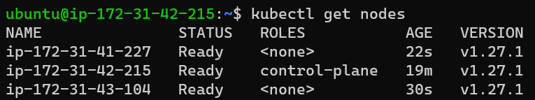

## Kubernetes
* Kubernetes also known as K8s, is an open-source system for automating deployment, scaling, and management of containerized applications. 

### Installing k8s cluster on ubuntu vms

* Create 2 ubuntu EC2 Instences which are accesible to each other with atlest 2 CPUS and 4 GB RAM
    * Install docker on all nodes
    * Install CRI-Dockerd [Refer Here](https://github.com/Mirantis/cri-dockerd)
    * Run the below commands as root user in all the nodes
```
# Run these commands as root
###Install GO###
wget https://storage.googleapis.com/golang/getgo/installer_linux
chmod +x ./installer_linux
./installer_linux
source ~/.bash_profile

git clone https://github.com/Mirantis/cri-dockerd.git
cd cri-dockerd
mkdir bin
go build -o bin/cri-dockerd
mkdir -p /usr/local/bin
install -o root -g root -m 0755 bin/cri-dockerd /usr/local/bin/cri-dockerd
cp -a packaging/systemd/* /etc/systemd/system
sed -i -e 's,/usr/bin/cri-dockerd,/usr/local/bin/cri-dockerd,' /etc/systemd/system/cri-docker.service
systemctl daemon-reload
systemctl enable cri-docker.service
systemctl enable --now cri-docker.socket
```
* Installing kubadm, kubectl, kubelet [Refer Here](https://kubernetes.io/docs/setup/production-environment/tools/kubeadm/install-kubeadm/#installing-kubeadm-kubelet-and-kubectl)

* Run the below commands as root user in all the nodes

```
cd ~
sudo apt-get update
sudo apt-get install -y apt-transport-https ca-certificates curl
sudo curl -fsSLo /etc/apt/keyrings/kubernetes-archive-keyring.gpg https://packages.cloud.google.com/apt/doc/apt-key.gpg
echo "deb [signed-by=/etc/apt/keyrings/kubernetes-archive-keyring.gpg] https://apt.kubernetes.io/ kubernetes-xenial main" | sudo tee /etc/apt/sources.list.d/kubernetes.list
sudo apt-get update
sudo apt-get install -y kubelet kubeadm kubectl
sudo apt-mark hold kubelet kubeadm kubectl
```
* Now create a cluster from a master node, use the command `kubeadm init --pod-network-cidr "10.244.0.0/16" --cri-socket "unix:///var/run/cri-dockerd.sock"`

* To start using your cluster, you need to run the following as a regular user:
```
mkdir -p $HOME/.kube
sudo cp -i /etc/kubernetes/admin.conf $HOME/.kube/config
sudo chown $(id -u):$(id -g) $HOME/.kube/config
```
* Setup kubeconfig, install flannel use the command `kubectl apply -f https://github.com/flannel-io/flannel/releases/latest/download/kube-flannel.yml`

* Now from manager execute `kubectl get nodes`

